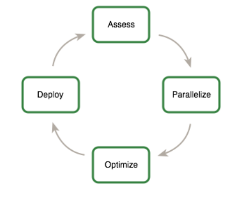

#  1. Preface
本最佳实践指南是一本帮助开发人员从 NVIDIA® CUDA® GPU 获得最佳性能的手册。它介绍了成熟的并行化和优化技术，并解释了可以大大简化支持 CUDA 的 GPU 架构编程的编码隐喻和习语。

虽然这些内容可以作为参考手册使用，但您应该注意到，在不同的编程和配置主题中，某些主题会在不同的上下文中被反复提及。因此，建议第一次阅读的读者按照顺序浏览本指南。这种方法将大大提高您对有效编程实践的理解，并使您在后续使用本指南作为参考时更加得心应手。

## 1.1 Who Should Read This Guide?

本指南中的讨论均使用 C++ 编程语言，因此您应该熟悉 C++ 代码的阅读。

本指南引用并依赖于若干其他文档，您应备有这些文档以供参考，这些文档都可以从 CUDA 网站 https://docs.nvidia.com/cuda/ 免费获取。以下文档是特别重要的资源：

    CUDA Installation Guide
    CUDA C++ Programming Guide
    CUDA Toolkit Reference Manual

特别是，本指南的优化部分假定您已经成功下载并安装了 CUDA Toolkit（如果尚未安装，请参考您平台相关的 CUDA 安装指南），并且您已经对 CUDA C++ 编程语言和环境有了基本的了解（如果不熟悉，请参考 CUDA C++ 编程指南）。

## 1.2. Assess, Parallelize, Optimize, Deploy
本指南介绍了应用程序的评估、并行化、优化、部署（Assess, Parallelize, Optimize, Deploy，APOD）设计循环，旨在帮助应用开发者快速识别其代码中最容易受益于 GPU 加速的部分，迅速实现这些加速，并尽早在生产环境中利用这种速度提升。

APOD 是一个循环过程：初步的速度提升可以在投入最少时间的情况下实现、测试和部署，然后通过再次识别进一步的优化机会，获得额外的速度提升，并将更快版本的应用程序部署到生产环境中，从而重新开始循环。



### 1.2.1. Assess

对于一个现有项目，第一步是评估应用程序，找出代码中占用大部分执行时间的部分。通过掌握这些知识，开发人员可以评估这些瓶颈的并行化潜力，并开始研究 GPU 加速。

通过理解终端用户的需求和限制，并应用 Amdahl 定律和 Gustafson 定律，开发人员可以确定通过加速应用程序的特定部分能够实现的性能提升上限。

Amdahl 定律和 Gustafson 定律是并行计算中的两个重要理论，用于分析并行程序的性能提升。以下是这两个定律的详细解释：

####  Amdahl 定律
Amdahl 定律描述了一个系统中并行化的最大潜在加速比，考虑了程序中必须串行执行的部分对性能提升的影响。它由 Gene Amdahl 于1967年提出，其公式如下：

$$ S = \frac{1}{(1 - P) + \frac{P}{N}} $$

其中：
- \( S \) 是加速比。
- \( P \) 是程序中可以并行化的部分所占的比例。
- \( N \) 是并行处理器的数量。

**解释**：
- 如果程序中有较大的串行部分（即 \(1 - P\) 较大），那么无论使用多少处理器，性能提升都非常有限。串行部分成为性能瓶颈。

#### Gustafson 定律
Gustafson 定律由 John L. Gustafson 于1988年提出，描述了并行系统在处理大规模问题时的效率提升。与 Amdahl 定律不同，Gustafson 定律考虑了随着处理器数量增加，处理问题规模也在增大的情况。其公式如下：

$$ S = N - (N - 1) \times (1 - P) $$

其中：
- \( S \) 是加速比。
- \( P \) 是程序中可以并行化的部分所占的比例。
- \( N \) 是并行处理器的数量。

**解释**：
- Gustafson 定律强调，通过增加处理器数量，我们可以处理更大规模的问题。在实际应用中，随着问题规模的增大，程序中可以并行化的部分（\(P\)）往往增大，从而可以更有效地利用并行处理器。

### 对比
- **Amdahl 定律** 假定问题规模不变，关注串行部分对并行系统性能提升的限制。
- **Gustafson 定律** 假定计算时间不变，关注并行系统在处理大规模问题时的效率提升。

这两个定律在理解并行计算系统的性能瓶颈和扩展性方面都非常重要. \
以上内容来自于copilot.microsoft

### 1.2.2. Parallelize
在识别出热点并完成基本的目标设定和期望之后，开发人员需要对代码进行并行化。根据原始代码的不同，这可以是简单地调用现有的 GPU 优化库，如 cuBLAS、cuFFT 或 Thrust，或者只是添加一些预处理器指令作为并行化编译器的提示。

另一方面，一些应用程序的设计可能需要一定程度的重构，以显露其内在的并行性。即使是 CPU 架构也需要显露并行性来提高或仅仅维持顺序应用程序的性能，CUDA 系列并行编程语言（如 CUDA C++、CUDA Fortran 等）旨在使表达这种并行性尽可能简单，同时能够在设计为最大并行吞吐量的支持 CUDA 的 GPU 上运行。

### 1.2.3. Optimize
在完成每轮应用程序并行化后，开发人员可以开始优化实现以提高性能。由于可以考虑的优化方法有很多，充分了解应用程序的需求可以帮助使这一过程尽可能顺利。然而，与整个 APOD 方法一样，程序优化是一个迭代过程（识别优化机会、应用和测试优化、验证实现的加速，然后重复），这意味着开发人员不需要在看到显著加速之前花费大量时间去记住所有可能的优化策略。相反，策略可以在学习过程中逐步应用。

优化可以在各个层面进行，从数据传输与计算的重叠到精细调整浮点操作序列。现有的分析工具对于指导这个过程非常宝贵，因为它们可以帮助开发人员建议优化工作的下一个最佳行动方案，并提供相关部分的参考。

### 1.2.4. Deploy
在完成应用程序的一个或多个组件的 GPU 加速后，可以将结果与最初的预期进行比较。回顾初始评估步骤，开发人员确定了通过加速特定热点所能达到的潜在最大加速比。

在处理其他热点以提高总体加速比之前，开发人员应考虑将部分并行化的实现版本投入到生产环境中。这一点非常重要，原因有很多，例如：尽早从他们的投资中获益（速度提升可能是部分的，但仍然具有价值），并通过对应用程序进行渐进式的改动，而不是革命性的变化，最大限度地降低开发人员和用户的风险。

## 1.3. Recommendations and Best Practices
在本指南中，针对 CUDA C++ 代码的设计和实现提出了具体的建议。这些建议按优先级分类，优先级是建议效果和其适用范围的结合。对大多数 CUDA 应用程序有显著改进的措施具有最高优先级，而仅影响非常特定情况的小优化则优先级较低。

在实施低优先级的建议之前，最好确保所有相关的高优先级建议已经被应用。这种方法通常会为投入的时间提供最佳结果，并避免过早优化的陷阱。

确立优先级的收益和范围标准会根据程序的性质而有所不同。在本指南中，它们代表了一种典型情况。您的代码可能会反映出不同的优先级因素。不管是否存在这种可能性，在处理低优先级项之前，最好先确认没有忽略任何高优先级的建议。
```
指南中的代码示例为了简洁起见省略了错误检查。然而，在生产代码中，应系统地检查每次 API 调用返回的错误代码，并通过调用 `cudaGetLastError()` 来检查内核启动中的失败情况。
```

## 1.4. Assessing Your Application
从超级计算机到手机，现代处理器越来越依赖并行性来提供性能。核心计算单元，包括控制、算术、寄存器和通常一些缓存，被复制若干次，并通过网络连接到内存。因此，所有现代处理器都需要并行代码以充分利用其计算能力。

虽然处理器正在演变以向程序员展示更细粒度的并行性，但许多现有应用程序要么是作为串行代码演变而来，要么是作为粗粒度并行代码演变而来（例如，将数据分解成并行处理的区域，并通过 MPI 共享子区域）。为了从任何现代处理器架构（包括 GPU）中获益，第一步是评估应用程序以识别热点，确定它们是否可以并行化，并了解当前和未来的相关工作负载。
```
MPI，是指消息传递接口 (Message Passing Interface) 
```