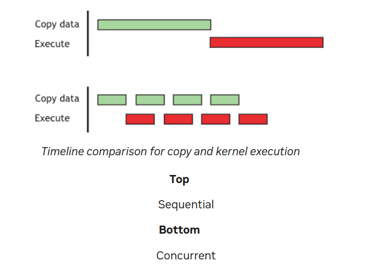
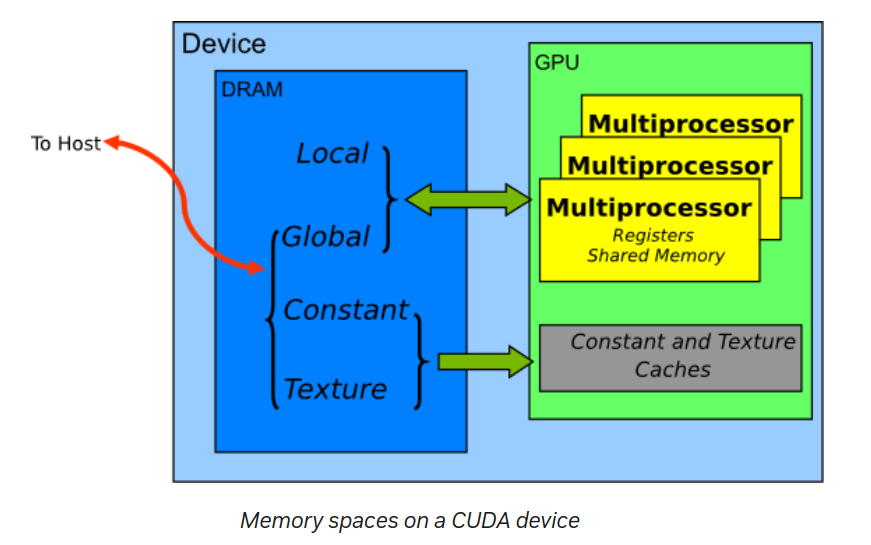
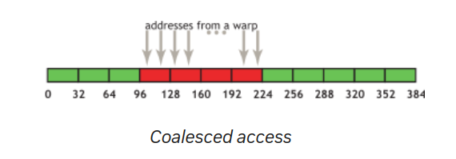
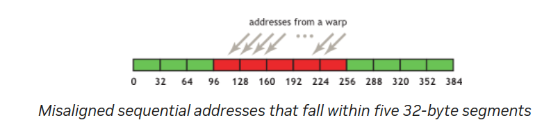
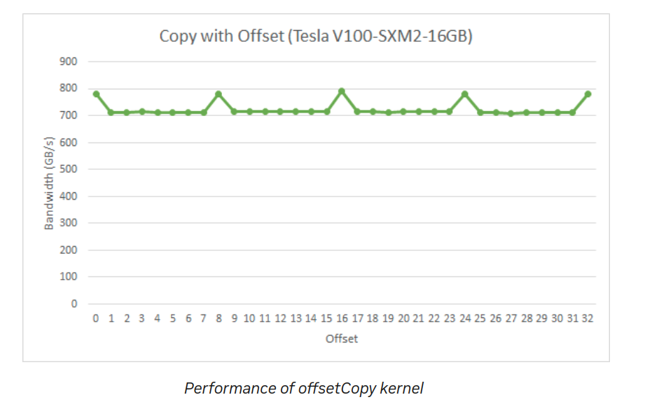
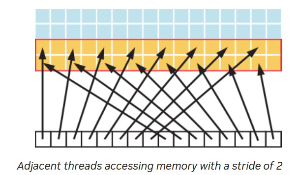
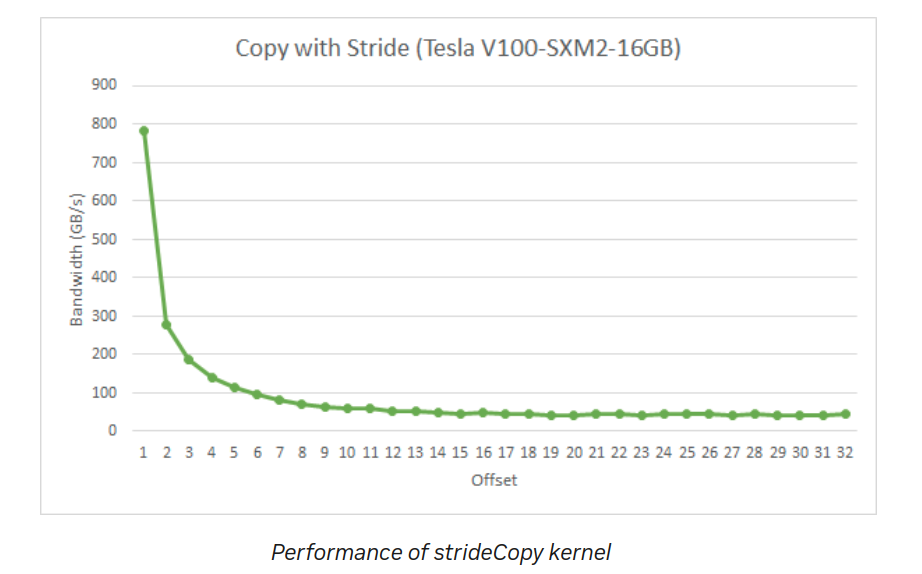
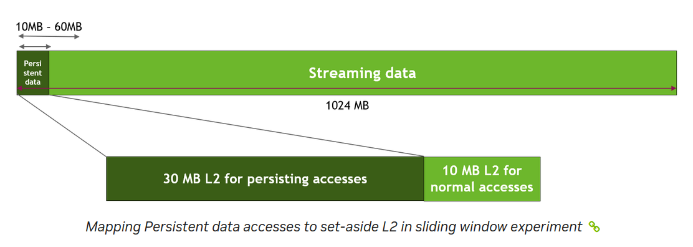
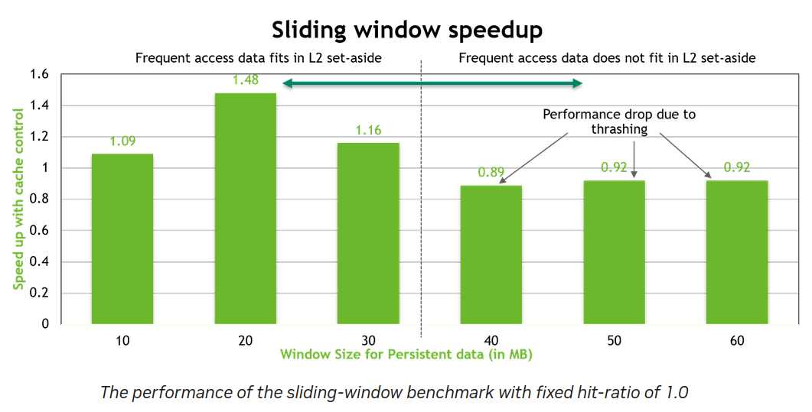
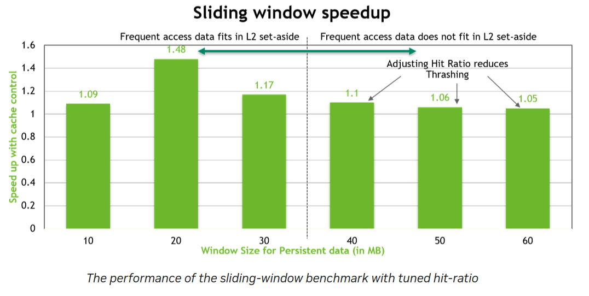

# 9. Memory Optimizations

内存优化是性能最重要的领域。目标是通过最大化带宽来最大化硬件的使用。带宽的最佳使用是尽可能多地使用快速内存并尽可能少地使用慢速访问内存。本章讨论主机和设备上的各种内存类型，以及如何最好地设置数据项以有效地使用内存。

## 9.1. Data Transfer Between Host and Device
设备内存和 GPU 之间的峰值理论带宽（例如，NVIDIA Tesla V100 上为 898 GB/s）远高于主机内存和设备内存之间的峰值理论带宽（在 PCIe x16 Gen3 上为 16 GB/s）。因此，为了获得最佳的整体应用性能，重要的是尽量减少主机和设备之间的数据传输，即使这意味着在 GPU 上运行的内核与在主机 CPU 上运行相比没有显示任何加速。

```
高优先级：尽量减少主机和设备之间的数据传输，即使这意味着在设备上运行一些与在主机 CPU 上运行相比没有显示性能提升的内核。
```

中间数据结构应在设备内存中创建，由设备操作并销毁，而不会被主机映射或复制到主机内存中。

此外，由于每次传输都存在开销，将许多小传输批处理成一个较大的传输表现显著优于单独进行每次传输，即使这样做需要将非连续的内存区域打包到连续的缓冲区中，然后在传输后解包。

最后，使用 Pinned Memory页锁定（或固定）内存可以实现主机和设备之间的更高带宽，正如 CUDA C++ 编程指南和本文件的页锁定内存部分中所讨论的那样。

###  9.1.1. Pinned Memory

```
固定内存通过防止操作系统将其页面交换到磁盘，使其始终驻留在物理内存中，从而加快数据传输速度。
```

页面锁定或固定内存传输在主机和设备之间达到最高带宽。例如，在 PCIe x16 Gen3 卡上，固定内存可以达到大约 12 GB/s 的传输速率。

固定内存通过 Runtime API 中的 cudaHostAlloc() 函数分配。bandwidthTest CUDA 示例展示了如何使用这些函数以及如何测量内存传输性能。

对于已经预分配的系统内存区域，可以使用 cudaHostRegister() 进行动态固定，无需分配单独的缓冲区并将数据复制到其中。

固定内存不应被过度使用。过度使用可能会降低整体系统性能，因为固定内存是一种稀缺资源，但事先难以确定多少为过多。此外，与大多数正常系统内存分配相比，固定系统内存是一个重量级操作，因此，和所有优化一样，测试应用程序及其运行的系统以确定最佳性能参数是至关重要的。

### 9.1.2. Asynchronous and Overlapping Transfers with Computation

主机和设备之间使用 cudaMemcpy() 进行的数据传输是阻塞传输，即只有在数据传输完成后，控制才会返回到主机线程。cudaMemcpyAsync() 函数是 cudaMemcpy() 的非阻塞变体，控制权立即返回到主机线程。与 cudaMemcpy() 相比，异步传输版本需要固定的主机内存（参见固定内存），并包含一个附加参数，即流 ID。流只是设备上按顺序执行的一系列操作。不同流中的操作可以交错，并且在某些情况下可以重叠——这种特性可以用来隐藏主机和设备之间的数据传输。

异步传输以两种不同方式实现数据传输与计算的重叠。在所有支持 CUDA 的设备上，可以重叠主机计算与异步数据传输和设备计算。例如，重叠计算和数据传输示范了在执行数据传输到设备和设备使用内核时，如何执行例程 cpuFunction() 中的主机计算。

* Overlapping computation and data transfers
    ```
    cudaMemcpyAsync(a_d, a_h, size, cudaMemcpyHostToDevice, 0);
    kernel<<<grid, block>>>(a_d);
    cpuFunction();
    ```
cudaMemcpyAsync() 函数的最后一个参数是流 ID，在这种情况下使用默认流（stream 0）。内核也使用默认流，并且在内存复制完成之前不会开始执行；因此，不需要显式同步。因为内存复制和内核都立即将控制权返回给主机，因此主机函数 cpuFunction() 与它们的执行重叠。

在“重叠计算和数据传输” 中，内存复制和内核执行按顺序发生。在支持并发复制和计算的设备上，可以将设备上的内核执行与主机和设备之间的数据传输重叠。设备是否具备这种能力由 cudaDeviceProp 结构的 asyncEngineCount 字段指示（或者在 deviceQuery CUDA 示例的输出中列出）。在具备这种能力的设备上，重叠同样需要固定的主机内存，此外，数据传输和内核必须使用不同的非默认流（具有非零流 ID 的流）。需要使用非默认流进行此重叠，因为使用默认流的内存复制、内存设置函数和内核调用仅在设备上所有先前的调用（在任何流中）完成后才开始，并且在它们完成之前，设备上没有操作（在任何流中）会开始。

* Concurrent copy and execute
    ```
    cudaStreamCreate(&stream1);
    cudaStreamCreate(&stream2);
    cudaMemcpyAsync(a_d, a_h, size, cudaMemcpyHostToDevice, stream1);
    kernel<<<grid, block, 0, stream2>>>(otherData_d);
    ```

在这段代码中，创建了两个流，并在 cudaMemcpyAsync 调用的最后一个参数和内核的执行配置中指定的方式中使用这些流进行数据传输和内核执行。

并发复制和执行展示了如何将内核执行与异步数据传输重叠。当数据依赖关系使得数据可以被分成多个块并分阶段传输时，可以使用这种技术，启动多个内核来操作每个到达的块。顺序复制和执行以及分阶段并发复制和执行展示了这一点。它们产生等效的结果。第一个段落显示了参考的顺序实现，它传输并操作一个包含 N 个浮点数的数组（假设 N 可以被 nThreads 整除）。

* Sequential copy and execute
    ```
    cudaMemcpy(a_d, a_h, N*sizeof(float), dir);
    kernel<<<N/nThreads, nThreads>>>(a_d);
    ```

分阶段并发复制和执行展示了如何将传输和内核执行分解为 nStreams 阶段。这种方法允许数据传输和执行部分重叠。
通过分阶段处理，可以同时进行多个传输和计算任务，从而提高整体性能。这种技术非常适用于需要频繁数据传输和计算的应用场景。

* Staged concurrent copy and execute
    ```
    size=N*sizeof(float)/nStreams;
    for (i=0; i<nStreams; i++) {
        offset = i*N/nStreams;
        cudaMemcpyAsync(a_d+offset, a_h+offset, size, dir, stream[i]);
        kernel<<<N/(nThreads*nStreams), nThreads, 0,
                stream[i]>>>(a_d+offset);
    }
    ```

在“分阶段并发复制和执行”中，假设 \( N \) 可以被 \( nThreads \times nStreams \) 整除。因为流内的执行是按顺序进行的，所以在各自流中的数据传输完成之前，内核不会启动。当前的 GPU 可以同时处理异步数据传输和执行内核。具有单个复制引擎的 GPU 可以执行一个异步数据传输并执行内核，而具有两个复制引擎的 GPU 可以同时执行从主机到设备的一个异步数据传输、从设备到主机的一个异步数据传输并执行内核。GPU 上复制引擎的数量由 `cudaDeviceProp` 结构的 `asyncEngineCount` 字段给出，这也在 `deviceQuery` CUDA 示例的输出中列出。（需要提到的是，不可能将阻塞传输与异步传输重叠，因为阻塞传输发生在默认流中，因此在所有先前的 CUDA 调用完成之前不会开始。它也不会允许任何其他 CUDA 调用在完成之前开始。）图 1 显示了两个代码段的执行时间线，在图的下半部分中，`nStreams` 等于 4，用于“分阶段并发复制和执行”。



在此示例中，假设数据传输时间和内核执行时间相当。在这种情况下，当执行时间 (\(t_E\)) 超过传输时间 (\(t_T\)) 时，分阶段版本的总体时间的粗略估计是 
$$  t_E + \frac{t_T}{nStreams} $$ 
而顺序版本则是 \( t_E + t_T \)。如果传输时间超过执行时间，则总体时间的粗略估计为 
$$  t_T + \frac{t_E}{nStreams}  $$


### 9.1.3. Zero Copy
零复制（Zero Copy） 是 CUDA Toolkit 2.2 中引入的一项功能。它允许 GPU 线程直接访问主机内存。为此，需要映射固定（非分页）内存。

对于集成 GPU（即 CUDA 设备属性结构的集成字段设置为 1 的 GPU），映射固定内存总是性能提升，因为它避免了冗余复制，因为集成 GPU 和 CPU 内存在物理上是相同的。对于离散 GPU，映射固定内存只有在某些情况下才有优势。由于数据未在 GPU 上缓存，映射固定内存应仅读取或写入一次，并且读写内存的全局加载和存储应合并。零复制可以代替流，因为源自内核的数据传输自动与内核执行重叠，而无需设置和确定最佳流数目的开销。

```
低优先级：在 CUDA Toolkit 版本 2.2 及以上的集成 GPU 上使用零复制操作。
```

在零复制主机代码中，展示了如何典型地设置零复制操作。通过这种方法，GPU 线程能够直接访问主机内存，从而避免了冗余复制和数据传输的开销。
```
float *a_h, *a_map;
...
cudaGetDeviceProperties(&prop, 0);
if (!prop.canMapHostMemory)
    exit(0);
cudaSetDeviceFlags(cudaDeviceMapHost);
cudaHostAlloc(&a_h, nBytes, cudaHostAllocMapped);
cudaHostGetDevicePointer(&a_map, a_h, 0);
kernel<<<gridSize, blockSize>>>(a_map);
```

在此代码中，使用 `cudaGetDeviceProperties()` 返回的结构的 `canMapHostMemory` 字段检查设备是否支持将主机内存映射到设备的地址空间。通过使用 `cudaSetDeviceFlags()` 并设置 `cudaDeviceMapHost` 来启用页面锁定内存映射。注意，必须在设置设备或进行需要状态的 CUDA 调用之前调用 `cudaSetDeviceFlags()` （也就是说，基本上是在创建上下文之前）。

页面锁定的映射主机内存使用 `cudaHostAlloc()` 分配，通过 `cudaHostGetDevicePointer()` 函数获取指向映射设备地址空间的指针。在“零复制主机代码”中的代码中，`kernel()` 可以使用指针 `a_map` 引用映射的固定主机内存，就像 `a_map` 指向设备内存中的位置一样。

```
映射固定主机内存允许你在避免使用 CUDA 流的情况下重叠 CPU-GPU 内存传输和计算。但由于对这些内存区域的任何重复访问会导致重复的 CPU-GPU 传输，因此建议在设备内存中创建第二个区域，以手动缓存先前读取的主机内存数据。
```

### 9.1.4. Unified Virtual Addressing
计算能力 2.0 及以上的设备在 64 位 Linux 和 Windows 系统上支持一种称为统一虚拟地址 (UVA) 的特殊寻址模式。使用 UVA，主机内存和所有已安装支持设备的设备内存共享单一的虚拟地址空间。

在统一虚拟地址 (UVA) 出现之前，应用程序需要跟踪每个指针是指向设备内存（以及对应的设备）还是指向主机内存，并为每个指针记录一段元数据（或在程序中硬编码）。使用 UVA 后，可以通过使用 cudaPointerGetAttributes() 函数检查指针的值来确定指针指向的物理内存空间。

在统一虚拟地址 (UVA) 模式下，通过 cudaHostAlloc() 分配的固定主机内存将具有相同的主机和设备指针，因此对于这些分配，不需要调用 cudaHostGetDevicePointer()。然而，对于通过 cudaHostRegister() 后期固定的主机内存分配，其设备指针与主机指针仍然不同，因此在这种情况下，仍然需要调用 cudaHostGetDevicePointer()。

没错，统一虚拟地址（UVA）也是实现点对点（P2P）数据传输的必要前提，在支持的配置中可以通过 PCIe 总线或 NVLink 在支持的 GPU 之间直接传输数据，绕过主机内存。这种传输方式可以进一步提升数据传输效率，特别是在多 GPU 环境下，使得数据处理更加高效。

了解更多有关统一虚拟地址 (UVA) 和点对点 (P2P) 的进一步解释和软件要求，可以参考 [CUDA C++ 编程指南](https://docs.nvidia.com/cuda/cuda-c-programming-guide/index.html) 中的相关章节。该指南提供了详细的信息和示例，帮助你更好地理解和应用这些技术。

## 9.2. Device Memory Spaces
CUDA 设备使用多种内存空间，它们具有不同的特性，反映了它们在 CUDA 应用中的不同用途。这些内存空间包括全局内存、本地内存、共享内存、纹理内存和寄存器，如图 2 所示。



在这些不同的内存空间中，全局内存（Global Memory）是最丰富的。有关在每个计算能力级别中每个内存空间的可用内存量，请参见 [CUDA C++ 编程指南](https://docs.nvidia.com/cuda/cuda-c-programming-guide/index.html) 中的功能和技术规格。全局内存、本地内存和纹理内存的访问延迟最大，其次是常量内存（Constant Memory）、共享内存（Shared Memory）和寄存器文件（Register File）。

不同类型内存的各种主要特性如下表所示：

| **内存类型** | **位置** | **缓存** | **访问** | **作用域** | **生命周期** |
|--------------|----------|----------|----------|------------|--------------|
| **寄存器**   | 芯片上   | 不适用   | 读/写    | 单线程     | 线程         |
| **本地内存** | 芯片外   | 是††     | 读/写    | 单线程     | 线程         |
| **共享内存** | 芯片上   | 不适用   | 读/写    | 同一块     | 块的生命周期 |
| **全局内存** | 芯片外   | 是†      | 读/写    | 所有线程 + 主机 | 主机分配   |
| **常量内存** | 芯片外   | 是       | 只读     | 所有线程 + 主机 | 主机分配   |
| **纹理内存** | 芯片外   | 是       | 只读     | 所有线程 + 主机 | 主机分配   |

- **缓存细节**：
  - † 默认情况下，在计算能力 6.0 和 7.x 的设备上缓存到 L1 和 L2；在较低计算能力的设备上默认仅缓存到 L2，但有些可以通过编译标志选择缓存到 L1。
  - †† 默认情况下缓存到 L1 和 L2，除了计算能力 5.x 的设备；计算能力 5.x 的设备只缓存到 L2。

在纹理访问的情况下，如果纹理引用绑定到全局内存中的线性数组，则设备代码可以写入底层数组。绑定到 CUDA 数组的纹理引用可以通过表面写操作写入，方法是将表面绑定到相同的底层 CUDA 数组存储。在同一次内核启动中，应该避免在写入其底层全局内存数组的同时从纹理读取，因为纹理缓存是只读的，当关联的全局内存被修改时不会失效。

```
CUDA 纹理内存是一种特殊的内存类型，主要用于高效地读取数据，尤其适用于图像处理和其他需要随机访问数据的应用。纹理内存允许我们利用硬件的纹理单元来进行高效的读取操作，并支持纹理过滤和地址计算。
```

### 9.2.1. Coalesced Access to Global Memory
在为 CUDA 兼容 GPU 架构编程时，一个非常重要的性能考虑因素是全局内存访问的合并。设备会将一个 warp 中线程的全局内存加载和存储操作合并成尽可能少的事务。

```
高优先级：尽可能确保全局内存访问的合并。
```
合并访问的要求取决于设备的计算能力，并在 [CUDA C++ 编程指南](https://docs.nvidia.com/cuda/cuda-c-programming-guide/index.html) 中有详细记录。

对于计算能力 6.0 或更高的设备，合并访问的要求可以总结如下：一个 warp 中线程的并发访问将合并为与满足所有线程所需的 32 字节事务数量相等的事务数。

对于计算能力为 5.2 的某些设备，可以选择启用对全局内存访问的 L1 缓存。如果在这些设备上启用了 L1 缓存，那么所需的事务数量等于所需的 128 字节对齐段的数量。

```
对于计算能力为 6.0 或更高的设备，L1 缓存是默认启用的。然而，无论全局加载是否缓存到 L1，数据访问单元都是 32 字节的。
```

在具有 GDDR 内存的设备上，当启用错误纠正码 (ECC) 时，以合并的方式访问内存尤为重要。分散的访问会增加 ECC 内存传输的开销，特别是在向全局内存写入数据时。

合并访问概念通过以下简单示例来说明。这些示例假设计算能力为 6.0 或更高，并且访问的是 4 字节字，除非另有说明。

#### 9.2.1.1. A Simple Access Pattern

第一个也是最简单的合并访问情况可以由任何计算能力为 6.0 或更高的 CUDA 设备实现：第 k 个线程访问 32 字节对齐数组中的第 k 个字。不需要所有线程都参与。

假设一个 warp 的线程访问相邻的 4 字节字（例如，相邻的 float 值），那么四个合并的 32 字节事务将服务于该内存访问。这种模式在图 3 中有所展示。



这种访问模式会导致四个 32 字节事务，如红色矩形所示。

即使在这四个 32 字节段中，只请求了一部分字（例如，如果多个线程访问相同的字，或者某些线程未参与访问），仍会获取整个段。此外，即使 warp 的线程在这四个段内或跨段进行了访问置换，对于计算能力为 6.0 或更高的设备，仍然只会执行四个 32 字节事务。

#### 9.2.1.2. A Sequential but Misaligned Access Pattern
如果 warp 中的连续线程访问的内存是顺序的，但不与 32 字节段对齐，则会请求五个 32 字节段，如图 4 所示。



通过 CUDA 运行时 API（如 cudaMalloc()）分配的内存保证至少对齐到 256 字节。因此，选择合理的线程块大小（如当前 GPU 上的 warp 大小的倍数，即 32），有助于确保 warp 的内存访问正确对齐。（例如，考虑如果线程块大小不是 warp 大小的倍数，第二个、第三个及后续线程块访问的内存地址会发生什么情况。）
```
在 CUDA 中，warp 是 GPU 并行计算的基本执行单元之一。一个 warp 由 32 个线程组成，这些线程同步执行相同的指令。
```

#### 9.2.1.3. Effects of Misaligned Accesses

探讨未对齐访问的影响是很有意义且容易实现的。你可以使用一个简单的拷贝内核来进行说明。例如，一个展示未对齐访问的拷贝内核如下：

* A copy kernel that illustrates misaligned accesses
```
__global__ void offsetCopy(float *odata, float* idata, int offset)
{
    int xid = blockIdx.x * blockDim.x + threadIdx.x + offset;
    odata[xid] = idata[xid];
}
```

在展示未对齐访问的拷贝内核中，数据从输入数组 idata 复制到输出数组 odata，两者都存在于全局内存中。内核在主机代码的一个循环中执行，该循环将参数 offset 从 0 到 32 进行变化。（例如，图 4 对应于这些未对齐的情况）。在 NVIDIA Tesla V100（计算能力 7.0）上，具有各种偏移量的拷贝的有效带宽如图 5 所示。



对于 NVIDIA Tesla V100，全局内存访问如果没有偏移或偏移是 8 字的倍数，则会导致四个 32 字节事务。这样可以实现大约 790 GB/s 的带宽。否则，每个 warp 将加载五个 32 字节段，我们预计在没有偏移的情况下达到约 4/5 的内存吞吐量。

在这个特定示例中，带有偏移的内存吞吐量约为正常情况下的 9/10，这是因为相邻的 warp 重用了邻近线程获取的缓存行。因此，虽然影响仍然存在，但并不像我们预期的那么大。如果相邻的 warp 没有表现出如此高的缓存行重用率，影响将会更大。

#### 9.2.1.4. Strided Accesses

正如上面所见，在未对齐的顺序访问情况下，缓存有助于缓解性能影响。然而，对于非单元步长的访问情况则可能不同，这种模式在处理多维数据或矩阵时经常出现。因此，确保每个缓存行获取的数据尽可能多地被实际使用是这些设备上内存访问性能优化的重要部分。

为了说明步长访问对有效带宽的影响，可以参考 strideCopy() 内核，这个内核用于说明非单元步长数据拷贝，将数据从 idata 拷贝到 odata，每个线程之间的数据步长为 stride 个元素。

* A kernel to illustrate non-unit stride data copy
```
__global__ void strideCopy(float *odata, float* idata, int stride)
{
    int xid = (blockIdx.x*blockDim.x + threadIdx.x)*stride;
    odata[xid] = idata[xid];
}
```

在图 6 中展示了这样一种情况：在这种情况下，warp 内的线程以步长为 2 的方式访问内存中的字。这种操作导致在 Tesla V100（计算能力 7.0）上，每个 warp 需要加载八个 L2 缓存段。



步长为 2 的情况下，加载/存储效率为 50%，因为事务中的一半元素未被使用，代表了带宽的浪费。随着步长增加，有效带宽下降，直到达到一个极限，即 warp 中的 32 个线程加载 32 个 32 字节段，如图 7 所示。

这种现象展示了步长访问对内存带宽利用率的影响。在优化 CUDA 程序时，尽量避免大步长访问，以减少带宽浪费，提高整体性能。这尤其重要在处理多维数组和矩阵等数据结构时。



如图 7 所示，应尽量避免非单元步长的全局内存访问。为了实现这一点，可以使用共享内存，这将在下一节中讨论。

### 9.2.2. L2 Cache
从 CUDA 11.0 开始，计算能力 8.0 及以上的设备具有影响 L2 缓存中数据持久性的能力。由于 L2 缓存位于芯片上，它可以为全局内存访问提供更高的带宽和更低的延迟。
有关更多详细信息，请参阅 CUDA C++ 编程指南中的 L2 访问管理部分。

#### 9.2.2.1. L2 Cache Access Window

当 CUDA 内核重复访问全局内存中的数据区域时，此类数据访问可以被视为持久访问。另一方面，如果数据只被访问一次，则此类数据访问可以被视为流式访问。L2 缓存的一部分可以专门用于全局内存中数据区域的持久访问。如果这部分专门的缓存未被持久访问使用，则流式或正常的数据访问可以使用它。

持久访问的 L2 缓存保留大小可以在一定范围内进行调整：

这使得开发者可以根据应用程序的具体需求优化缓存使用，从而提高整体性能。
```
cudaGetDeviceProperties(&prop, device_id);
cudaDeviceSetLimit(cudaLimitPersistingL2CacheSize, prop.persistingL2CacheMaxSize); /* Set aside max possible size of L2 cache for persisting accesses */
```

用户数据到 L2 保留部分的映射可以通过 CUDA 流或 CUDA 图内核节点上的访问策略窗口来控制。下面的例子展示了如何在 CUDA 流上使用访问策略窗口：

```
cudaStreamAttrValue stream_attribute;                                         // Stream level attributes data structure
stream_attribute.accessPolicyWindow.base_ptr  = reinterpret_cast<void*>(ptr); // Global Memory data pointer
stream_attribute.accessPolicyWindow.num_bytes = num_bytes;                    // Number of bytes for persisting accesses.
                                                                              // (Must be less than cudaDeviceProp::accessPolicyMaxWindowSize)
stream_attribute.accessPolicyWindow.hitRatio  = 1.0;                          // Hint for L2 cache hit ratio for persisting accesses in the num_bytes region
stream_attribute.accessPolicyWindow.hitProp   = cudaAccessPropertyPersisting; // Type of access property on cache hit  // 持久性访问属性
stream_attribute.accessPolicyWindow.missProp  = cudaAccessPropertyStreaming;  // Type of access property on cache miss.   // 流式访问属性

//Set the attributes to a CUDA stream of type cudaStream_t
cudaStreamSetAttribute(stream, cudaStreamAttributeAccessPolicyWindow, &stream_attribute);
```

访问策略窗口需要 hitRatio 和 num_bytes 的值。根据 num_bytes 参数的大小和 L2 缓存的大小，可能需要调整 hitRatio 的值，以避免 L2 缓存行的抖动。
```
hitRatio 参数决定了 L2 缓存中有多少空间将被分配给持久性访问数据。

较高的 hitRatio：意味着更多的 L2 缓存行将被保留给持久性访问的数据。这对于频繁访问相同数据的情况很有帮助，因为可以减少缓存未命中次数，提高性能。
较低的 hitRatio：意味着较少的 L2 缓存行将被保留给持久性访问的数据。这样可以为流式访问的数据保留更多缓存空间，防止缓存被过度占用。
```

#### 9.2.2.2. Tuning the Access Window Hit-Ratio
hitRatio 参数可用于指定接收 hitProp 属性的访问比例。例如，如果 hitRatio 值为 0.6，则全局内存区域 [ptr, ptr+num_bytes] 中 60% 的内存访问具有持久属性，而 40% 的内存访问具有流式属性。为了了解 hitRatio 和 num_bytes 的影响，我们使用滑动窗口微基准测试。

该微基准测试使用 GPU 全局内存中的 1024 MB 区域。首先，我们使用 cudaDeviceSetLimit() 将 30 MB 的 L2 缓存分配给持久访问，如前所述。然后，如下图所示，我们指定对内存区域前 freqSize * sizeof(int) 字节的访问为持久性访问。因此，这些数据将使用 L2 缓存的保留部分。在我们的实验中，我们将这种持久数据区域的大小从 10 MB 变化到 60 MB，以模拟数据适合或超出 30 MB 的 L2 缓存保留部分的各种场景。请注意，NVIDIA Tesla A100 GPU 的总 L2 缓存容量为 40 MB。对内存区域剩余数据（即流式数据）的访问被视为正常或流式访问，因此将使用剩余的 10 MB 非保留的 L2 缓存部分（除非部分 L2 缓存保留部分未被使用）。



考虑以下内核代码和访问窗口参数，作为滑动窗口实验的实现。

```
__global__ void kernel(int *data_persistent, int *data_streaming, int dataSize, int freqSize) {
    int tid = blockIdx.x * blockDim.x + threadIdx.x;

    /*Each CUDA thread accesses one element in the persistent data section
      and one element in the streaming data section.
      Because the size of the persistent memory region (freqSize * sizeof(int) bytes) is much
      smaller than the size of the streaming memory region (dataSize * sizeof(int) bytes), data
      in the persistent region is accessed more frequently*/

    data_persistent[tid % freqSize] = 2 * data_persistent[tid % freqSize];
    data_streaming[tid % dataSize] = 2 * data_streaming[tid % dataSize];
}

stream_attribute.accessPolicyWindow.base_ptr  = reinterpret_cast<void*>(data_persistent);
stream_attribute.accessPolicyWindow.num_bytes = freqSize * sizeof(int);   //Number of bytes for persisting accesses in range 10-60 MB
stream_attribute.accessPolicyWindow.hitRatio  = 1.0;
```

上面内核的性能如下图所示。当持久性数据区域很好地适应 L2 缓存的 30 MB 保留部分时，性能提高了多达 50%。然而，一旦持久性数据区域的大小超过 L2 保留缓存部分的大小，由于 L2 缓存行的抖动，性能大约下降了 10%。



为了优化性能，当持久性数据的大小超过保留的 L2 缓存部分的大小时，我们可以调整 num_bytes 和 hitRatio 参数，具体如下：
```
stream_attribute.accessPolicyWindow.base_ptr  = reinterpret_cast<void*>(data_persistent);
stream_attribute.accessPolicyWindow.num_bytes = 20*1024*1024;                                  //20 MB
stream_attribute.accessPolicyWindow.hitRatio  = (20*1024*1024)/((float)freqSize*sizeof(int));  //Such that up to 20MB of data is resident.
```

我们将访问窗口中的 num_bytes 固定为 20 MB，并调整 hitRatio，使总共 20 MB 的持久性数据能够随机驻留在 L2 缓存保留部分中。持久性数据的其余部分将使用流式属性进行访问。这有助于减少缓存抖动。下图显示了结果，无论持久性数据是否适合 L2 缓存保留部分，我们都可以看到良好的性能表现。



### 9.2.3. Shared Memory


